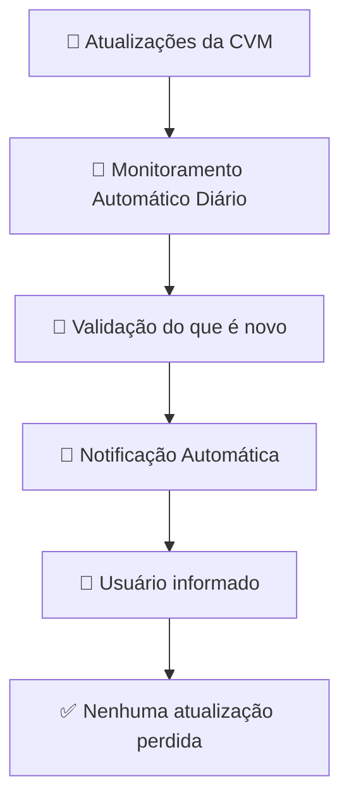

# 🚀 Resumo

Automação para monitoramento contínuo do feed oficial de legislação da CVM, eliminando consultas manuais e reduzindo o risco de esquecimento de atualizações relevantes.

A solução utiliza o **N8N** para consumir o RSS oficial, identificar novos normativos com base em histórico persistido e enviar notificações automatizadas por email, garantindo confiabilidade e rastreabilidade do processo.

---

# 🎯 Objetivo

Garantir que novos normativos da CVM sejam:

- Detectados automaticamente (sem acesso manual ao site)
- Validados como “novos” (sem duplicidade)
- Notificados por email de forma estruturada
- **Nunca esquecidos ou ignorados por falha humana**

---

# 🧱 Arquitetura da Solução

## Componentes

**Trigger**
- Execução diária (Cron)

**Fonte de dados**
- RSS oficial da CVM  
- http://www.cvm.gov.br/feed/legislacao.xml

**Processamento**
- Parsing do RSS  
- Identificação de novos itens  

**Persistência leve**
- Armazenamento de IDs já processados  

**Notificação**
- Envio de email  

---

# 🔄 Diagrama de Fluxo

# 🔄 Automação na Prática

https://github.com/user-attachments/assets/4f5a937e-044f-4237-81fd-4502feab3cd3

