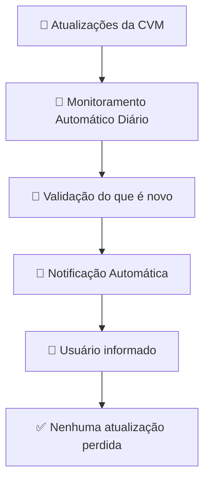

# 🚀 Resumo

Automação para monitoramento contínuo do feed oficial de legislação da CVM, eliminando consultas manuais e reduzindo o risco de esquecimento de atualizações relevantes.

A solução utiliza o **N8N** para consumir o RSS oficial, identificar novos normativos com base em histórico persistido e enviar notificações automatizadas por email, garantindo confiabilidade e rastreabilidade do processo.

---

## 👤 User Story

Como um profissional que precisa acompanhar atualizações regulatórias da CVM,  
Desejo receber automaticamente novas publicações por email,  
Para que eu não dependa de verificações manuais e não corra o risco de perder atualizações importantes.

## 🎯 Contexto do Problema

Hoje o acompanhamento de normativos depende de consulta manual ao site da CVM.

Isso gera riscos como:
- Esquecimento da verificação diária
- Perda de atualizações relevantes
- Falta de padronização no acompanhamento
- Dependência de disciplina individual

---

## 💡 Solução Proposta

Automatizar o monitoramento do feed oficial da CVM.

---

## 🧠 Valor de Negócio

- Redução do risco de esquecimento humano
- Garantia de acompanhamento contínuo
- Padronização do processo de monitoramento
- Aumento da confiabilidade da informação recebida

---

## 🧠 Pensamento Computacional

### 1. Decomposição
O problema foi dividido em etapas simples: buscar dados da CVM, processar informações, identificar novidades e enviar notificações automáticas.

### 2. Reconhecimento de Padrões
Os normativos seguem uma estrutura consistente (título, link e data), permitindo identificar cada item de forma única pelo link.

### 3. Abstração
Foram considerados apenas os elementos essenciais (link, título e data), ignorando dados irrelevantes para garantir simplicidade e confiabilidade.

### 4. Algoritmo
O sistema verifica cada item do feed, compara com histórico de itens já vistos e envia email apenas para novos normativos, evitando duplicidade e esquecimentos.

---

# 🔄 Diagrama de Fluxo

# 🔄 Automação na Prática

https://github.com/user-attachments/assets/4f5a937e-044f-4237-81fd-4502feab3cd3

---

# 🧱 Arquitetura da Solução

## Componentes

**Trigger**
- Execução diária (Cron)

**Fonte de dados**
- RSS oficial da CVM  
- http://www.cvm.gov.br/feed/legislacao.xml

**Processamento**
- Parsing do RSS  
- Identificação de novos itens  

**Persistência leve**
- Armazenamento de IDs já processados  

**Notificação**
- Envio de email  

---

